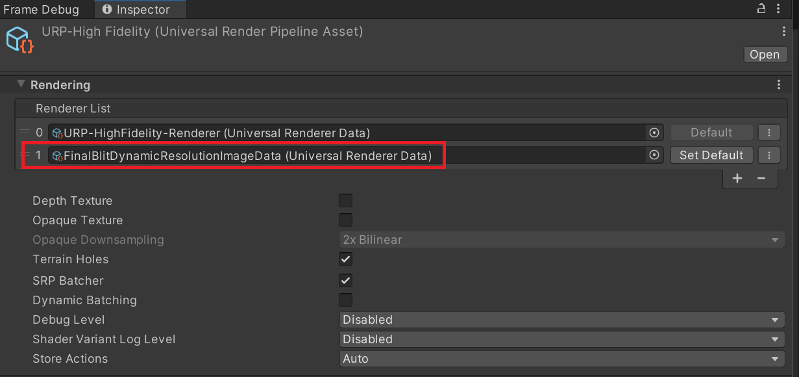
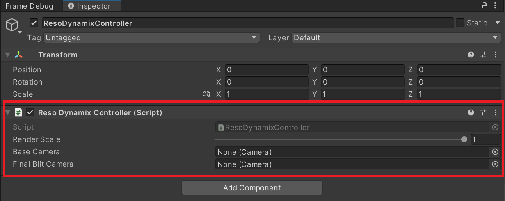
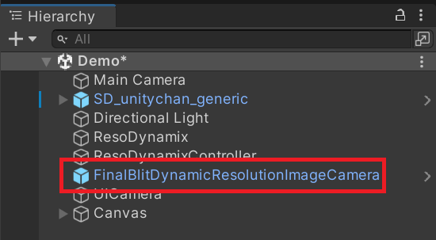
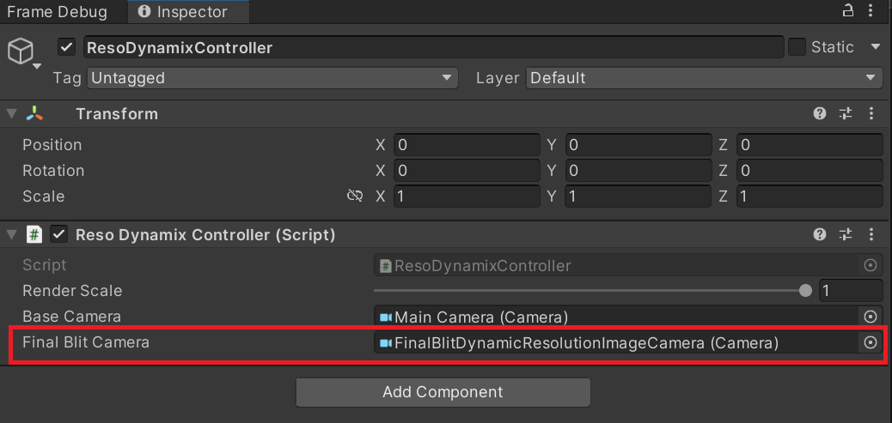
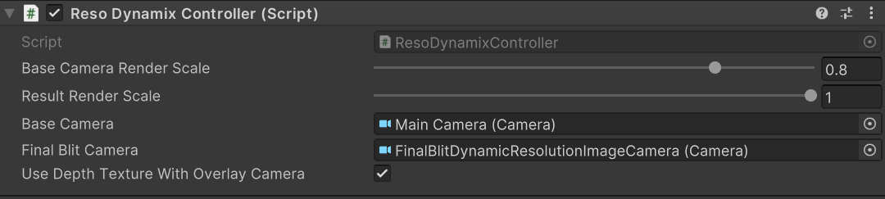

# ResoDynamix
This document is for Reso Dynamix (Unity 2022 or Compatible version).

If you are using Unity 6 (Render Graph), please refer to the following document.

[Documentation (Render Graph)](README_2022_or_Compatible.md)<br/>

## 1. Overview
ResoDynamix is a dynamic resolution change library that allows you to change the rendering resolution of base cameras and overlay cameras.<br/>
While uGUI-based UI rendering can be rendered at a different resolution from the base camera by setting the Render Mode to Overlay, this library allows you to render at a different resolution from the base camera even when the Render Mode is not Overlay.<br/>

## 2. How To Use

### 2.1 Installation to Project
Installation is performed using the following steps.

1. Select Window > Package Manager
2. Select the "+" button > Add package from git URL
3. Enter the following to install:
   * git+ssh://git@github.com/SGE-CoreTech/ResoDynamix.git?path=/Assets/ResoDynamix#compatible-mode

<p align="center">
  
</p>

Alternatively, open Packages/manifest.json and add the following to the dependencies block.

```json
{
    "dependencies": {
        "jp.co.cyberagent.reso-dynamix": "git+ssh://git@github.com/SGE-CoreTech/ResoDynamix.git?path=/Assets/ResoDynamix#compatible-mode"
    }
}
```


* git+ssh://git@github.com/SGE-CoreTech/ResoDynamix.git?path=/Assets/ResoDynamix#compatible-mode

Note: If you see a message like `No 'git' executable was found. Please install Git on your system and restart Unity`, you need to set up Git on your machine.

To update the version, rewrite the version using the above procedure.  


### 2.2 Add FinalBlitDynamicResolutionImageData to Universal Render Pipeline Asset
Add ```ResoDynamix/Runtime/Scripts/RenderPipeline/Data/FinalBlitDynamicResolutionImageData``` to the Renderer List of the Universal Render Pipeline Asset.<br/>



### 2.3 Add Create Dynamix Resolution Image Feature to Universal Renderer Data
Add ```Create Dynamix Resolution Image Feature``` to the Universal Renderer Data used for rendering the scene.<br/>


### 2.4 Add ResoDynamix
Add the ResoDynamix component to the scene. Note that only one instance of this component can be placed in a scene.<br/>


### 2.5 Add ResoDynamixController
Add ResoDynamixController to the scene. Multiple instances of this component can be placed in a scene.<br/>


### 2.6 Add FinalBlitDynamicResolutionImageCamera.prefab
Add ```ResoDynamix/Prefabs/FinalBlitDynamicResolutionImageCamera.prefab``` to the scene. Note that this prefab must be one-to-one with ResoDynamixController.<br/>



### 2.7 Specify Base Camera to Change Resolution
Specify the base camera whose resolution you want to change in the BaseCamera field of ResoDynamixController.<br/>


### 2.8 Specify Camera to Apply Dynamic Resolution Texture to Scene
Specify the FinalBlitDynamicResolutionImageCamera.prefab placed in step 2.4 in the FinalBlitCamera field of ResoDynamixController.<br/>



### 2.9 Add ResoDynamixController to ResoDynamix
Add the ResoDynamixController placed in step 2.4 to the Controllers field of the ResoDynamix placed in step 2.3.<br/>


## 3. Reso Dynamix Component Parameters


| Property Name | Description |
| ---- | ---- |
|Controllers| Reso Dynamix Controllers placed in the scene.<br/>All controllers placed in the scene must be registered here.|

## 4. Reso Dynamix Controller Component Parameters


| Property Name | Description |
| ---- | ---- |
| Base Camera Render Scale | The rendering scale of the Base Camera.<br/>You can change the rendering resolution of the Base Camera by changing this value. When the Render Scale is 1.0, Reso Dynamix processing is skipped. |
| Result Render Scale | The rendering scale of the final hybrid image generated.<br/>You can also change the UI resolution by changing this resolution secondarily.<br/> |
| Base Camera | Base Camera |
| Final Blit Camera | The camera that blits the generated hybrid resolution image to the frame buffer.<br/> [Related Link: Add FinalBlitDynamicResolutionImageCamera.prefab](#2.6)|
| Use Depth Texture With Overlay Camera| Checkbox for whether to use depth texture in overlay camera rendering. <br/> Check this if you want to use depth testing or stencil masks in the overlay camera.|

