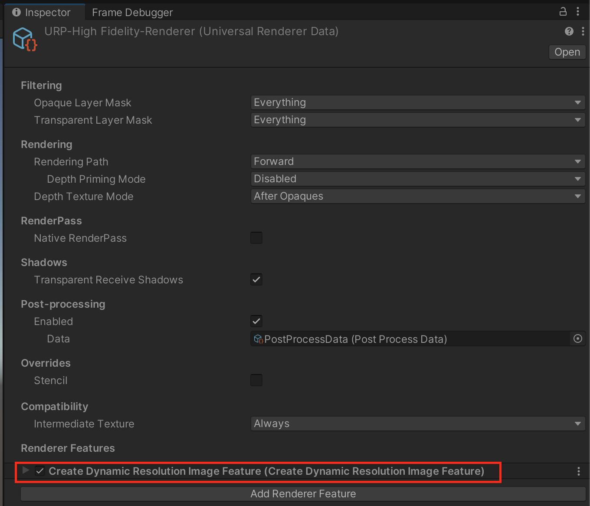
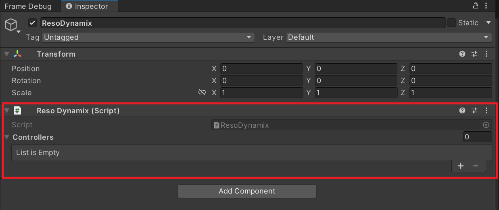
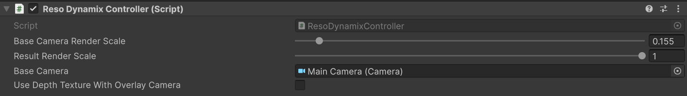
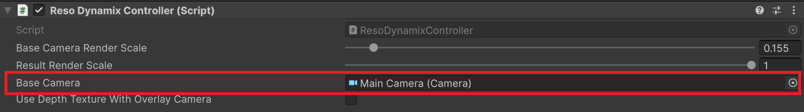
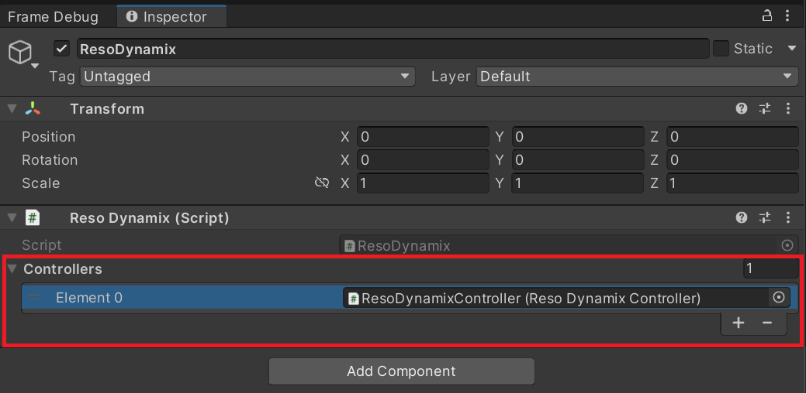
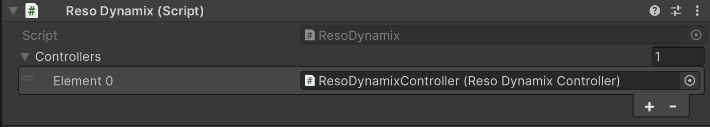

# ResoDynamix
このドキュメントは最新のReso Dynamix( Unity6 RenderGraph版 )のドキュメントです。

[ドキュメント( English )](README.md)<br/>

## 1. 概要
ResoDynamixはベースカメラとオーバーレイカメラの描画解像度を変えることができる動的解像度変更ライブラリです。<br/>
uGUIを用いたUI描画はRender ModeにOverlayを指定することで、ベースカメラとは別の解像度で描画することができますが、このライブラリを使用するとRender ModeがOverlay以外の場合でもベースカメラとは別の解像度で描画することができます。<br/>

## 2. How To Use

### 2.1 プロジェクトへのインストール
インストールは以下の手順で行います。

1. Window > Package Manager を選択
2. 「+」ボタン > Add package from git URL を選択
3. 以下を入力してインストール
   * git+ssh://git@git@github.com:CyberAgentGameEntertainment/ResoDynamix.git?path=/Assets/ResoDynamix

<p align="center">
  
</p>

あるいはPackages/manifest.jsonを開き、dependenciesブロックに以下を追記します。

```json
{
    "dependencies": {
        "jp.co.cyberagent.reso-dynamix": "git+ssh://git@git@github.com:CyberAgentGameEntertainment/ResoDynamix.git?path=/Assets/ResoDynamix"
    }
}
```

バージョンを指定したい場合には以下のように記述します。

* git+ssh://git@git@github.com:CyberAgentGameEntertainment/ResoDynamix.git?path=/Assets/ResoDynamix#1.0.0

なお`No 'git' executable was found. Please install Git on your system and restart Unity`のようなメッセージが出た場合、マシンにGitをセットアップする必要がある点にご注意ください。

バージョンを更新するには上述の手順でバージョンを書き換えてください。  
バージョンを指定しない場合には、package-lock.jsonファイルを開いて本ライブラリの箇所のハッシュを書き換えることで更新できます。

```json
{
  "dependencies": {
      "jp.co.cyberagent.reso-dynamix": {
      "version": "git+ssh://git@github.com:CyberAgentGameEntertainment/ResoDynamix.git?path=/Assets/ResoDynamix",
      "depth": 0,
      "source": "git",
      "dependencies": {},
      "hash": "..."
    }
  }
}
```

### 2.2 Create Dynamix Resolution Image FeatureをUniversal Renderer Dataに追加
```Create Dynamix Resolution Image Feature```をシーンの描画に使っているUniversal Renderer Dataに追加してください。<br/>


### 2.3 ResoDynamixを追加
シーンにResoDynamixコンポーネントを追加してください。なお、このコンポーネントはシーンに一つだけしか設置できません。<br/>


### 2.4 ResoDynamixControllerを追加
シーンにResoDynamixControllerを追加してください。このコンポーネントはシーンに複数設置することができます。<br/>



### 2.5 解像度を変えたいベースカメラを指定
解像度を解像度を変えたいベースカメラをResoDynamixControllerのBaseCameraに指定してください。<br/>




### 2.6 ResoDynamixにResoDynamixControllerを追加
2.4で設置したResoDynamixControllerを2.3で設置したResoDynamixのControllersに追加してください。<br/>



## 3. Reso Dynamixコンポーネントのパラメータ


| プロパティ名 | 説明 |
| ---- | ---- |
|Controllers| シーンに設置されているReso Dynamix Controller。<br/>シーンに設置されているコントローラーは全てここに登録されている必要があります。|

## 4. Reso Dynamix Controllerコンポーネントのパラメータ


| プロパティ名 | 説明 |
| ---- | ---- |
| Base Camera Render Scale | Base Cameraのレンダリングスケール。<br/>この数値を変更することでBase Cameraのレンダリング解像度を変更することができます。Render Scaleが1.0になっている場合はReso Dynamixによる処理はスキップされます。 |
| Result Render Scale | 最終的に生成されるハイブリッドイメージのレンダリングスケール。<br/>副次的にこの解像度を変更することでUIの解像度を変更することもできるため、UIの描画負荷を落としたい場合などは1以下を指定してください。<br/> ただし、このレンダースケールに1以下が設定されている場合はそのための中間テクスチャが必要になるためその分のメモリ使用量が増加します。|
| Base Camera | ベースカメラ |
| Use Depth Texture With Overlay Camera| オーバーレイカメラの描画で深度テクスチャを利用するかどうかのチェックボックス。 <br/> オーバーレイカメラで深度テストやステンシルマスクを利用したい場合はこのチェックをオンにしてください。|